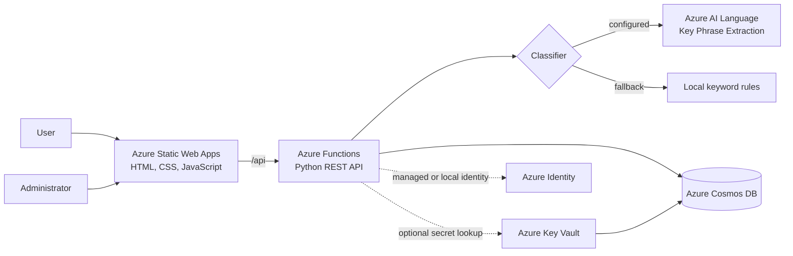

# MyMahir IT Ticket Triage Group 4

A cloud-based helpdesk application developed for the Microsoft AI-200 Capstone Project under the MyMahir FullStack programme. Users submit support requests, the system suggests a category, and administrators review and update tickets stored in Azure Cosmos DB.

## Features

- Submit tickets with requester details, title, description, priority, and an optional category.
- Classify tickets into six support categories.
- Use Azure AI Language key-phrase extraction when configured, with deterministic keyword rules as a resilient fallback.
- Store the suggested category, classification method, confidence, and evidence with each ticket.
- Allow a manual category to override the suggestion without discarding it.
- Display ticket totals and the configured classifier chain.
- Search by ticket ID, requester name, email, title, or description.
- Filter by category, status, and requester email.
- Update ticket categories and statuses from the admin dashboard.
- Store tickets in Azure Cosmos DB.
- Load Cosmos DB credentials from environment settings or Azure Key Vault.

## Architecture



The browser calls the same-origin `/api` path. Azure Static Web Apps serves the frontend and integrates the Python Functions API. When a ticket is created, the API classifies its title and description, persists the completed document in Cosmos DB, and returns it to the browser. Changing a category requires a delete-and-recreate operation because `/category` is the Cosmos DB partition key.

> All API functions currently use anonymous HTTP authorization. The admin-key input is forwarded as an `x-admin-key` header, but the backend does not validate it. The dashboard should not be considered access-controlled until authentication and authorization are implemented.

## Project layout

```text
.
|-- api/
|   |-- function_app.py              # Azure Functions HTTP routes
|   |-- shared/
|   |   |-- categories.py            # Category ontology and scoring
|   |   |-- classifier.py            # Azure AI + keyword fallback
|   |   |-- config.py                # Environment configuration
|   |   `-- repository.py            # Cosmos DB and Key Vault access
|   |-- Dockerfile                   # Python 3.11 Functions image
|   |-- host.json                    # Functions host configuration
|   |-- local.settings.example.json  # Local settings template
|   `-- requirements.txt             # Python dependencies
|-- frontend/
|   |-- css/styles.css
|   |-- js/
|   |   |-- api.js                   # REST client and UI helpers
|   |   |-- submit.js                # Submission workflow
|   |   `-- admin.js                 # Dashboard and updates
|   |-- index.html
|   |-- admin.html
|   `-- staticwebapp.config.json     # Routes, runtime, headers
|-- tests/                           # Pytest tests
|-- .github/workflows/               # Static Web Apps CI/CD
|-- package.json                     # Static Web Apps CLI
`-- README.md
```

## Technology stack

| Layer | Technologies |
|---|---|
| Frontend | HTML5, CSS3, vanilla JavaScript ES modules |
| Hosting/routing | Azure Static Web Apps, Static Web Apps CLI |
| Backend | Python, Azure Functions v4, Python v2 programming model |
| Classification | Azure AI Language Key Phrase Extraction, weighted keyword rules |
| Data | Azure Cosmos DB for NoSQL, `/category` partition key |
| Identity/secrets | Azure Identity `DefaultAzureCredential`, Azure Key Vault Secrets |
| Containers | Docker, Azure Functions Python 3.11 base image |
| Testing | pytest, mocks |
| CI/CD | GitHub Actions, Azure Static Web Apps deploy action |

The deployed Static Web Apps API runtime is Python 3.10; the standalone Docker image uses Python 3.11.

## API endpoints

All endpoints are relative to `/api` and currently allow anonymous access.

| Method | Endpoint | Description | Inputs | Success |
|---|---|---|---|---|
| `GET` | `/api/health` | Health, ticket total, storage, and classifier chain | None | `200` |
| `GET` | `/api/categories` | Supported categories, statuses, and priorities | None | `200` |
| `POST` | `/api/tickets` | Classify, create, and store a ticket | JSON body | `201` |
| `GET` | `/api/tickets` | List and filter tickets | `category`, `status`, `email`, `q` | `200` |
| `GET` | `/api/tickets/{ticket_id}` | Get one ticket | Ticket ID path parameter | `200` |
| `PATCH` | `/api/tickets/{ticket_id}` | Update status and/or category | JSON body | `200` |

### Create a ticket

```http
POST /api/tickets
Content-Type: application/json

{
  "name": "Aiman Rahman",
  "email": "aiman@example.com",
  "title": "Cannot access campus Wi-Fi",
  "description": "My laptop cannot connect to the campus Wi-Fi network.",
  "priority": "Medium",
  "category": ""
}
```

`name`, `email`, `title`, and `description` are required. `priority` defaults to `Medium`. Leave `category` empty or omit it for automatic classification; otherwise, the supplied category is used and the automatic suggestion is retained separately.

Supported values:

- Categories: `IT Support`, `Facilities`, `Course Registration`, `Student Finance`, `Library Services`, `General Enquiry`
- Statuses: `New`, `Categorised`, `In Progress`, `Resolved`
- Priorities: `Low`, `Medium`, `High`

### List and filter tickets

```http
GET /api/tickets?category=IT%20Support&status=New&q=wifi
```

Filters are case-insensitive and can be combined. `q` searches the ticket ID, name, email, title, and description. The response is `{ "items": [...] }`.

### Update a ticket

```http
PATCH /api/tickets/TKT-A1B2C3D4
Content-Type: application/json

{
  "status": "In Progress",
  "category": "IT Support"
}
```

Invalid values return `400`, a missing ticket returns `404`, and backend or service failures return `500`.

## Run locally with Docker

The Dockerfile runs the backend. The Static Web Apps CLI serves the frontend and proxies `/api` to the container.

### Prerequisites

- Docker Desktop or a compatible engine
- Node.js 20+ and npm
- A Cosmos DB database and container with partition key `/category`
- Cosmos credentials, or Key Vault access configured for the container
- Optional: an Azure AI Language resource

### 1. Install frontend tooling

```powershell
npm install
```

### 2. Create `api/api.env`

This file is already ignored by Git. Replace the examples with real values:

```dotenv
AzureWebJobsStorage=
FUNCTIONS_WORKER_RUNTIME=python
COSMOS_DATABASE=your-database-name
COSMOS_CONTAINER=your-container-name
COSMOS_ENDPOINT=https://your-account.documents.azure.com:443/
COSMOS_KEY=your-cosmos-key
AZURE_LANGUAGE_ENDPOINT=https://your-language-resource.cognitiveservices.azure.com
AZURE_LANGUAGE_KEY=your-language-key
AZURE_LANGUAGE_API_VERSION=
AZURE_LANGUAGE_TIMEOUT_SECONDS=
```

Azure AI settings are optional; without them, local keyword rules are used. Direct `COSMOS_ENDPOINT` and `COSMOS_KEY` values are simplest in Docker. Alternatively, omit both and set `KEY_VAULT_URL`; the container must then expose credentials supported by `DefaultAzureCredential` and have permission to read Key Vault secrets named `CosmosEndpoint` and `CosmosKey`.


### 3. Build and run the API

```powershell
docker build -t mymahir-ticket-api ./api
docker run --rm --name mymahir-ticket-api --env-file ./api/api.env -p 7071:80 mymahir-ticket-api
```

Verify the API from another terminal:

```powershell
Invoke-RestMethod http://localhost:7071/api/categories
```

- Submission page: `http://localhost:4280`
- Admin dashboard: `http://localhost:4280/admin`

Stop each process with `Ctrl+C`. Because the container uses `--rm`, Docker removes it after it stops.

### 4. Test the Docker API

The examples below use PowerShell and call the Functions container directly on port `7071`. Keep the Docker container running while executing them.

Check the reference-data endpoint first. This endpoint does not access Cosmos DB, so it is also a useful basic container health check:

```powershell
Invoke-RestMethod -Method Get `
  -Uri "http://localhost:7071/api/categories"
```

Check the full API health endpoint. This endpoint reads Cosmos DB to calculate the total ticket count:

```powershell
Invoke-RestMethod -Method Get `
  -Uri "http://localhost:7071/api/health"
```

Create a ticket and retain the response in `$ticket`:

```powershell
$body = @{
  name        = "Docker Test User"
  email       = "docker.test@example.com"
  title       = "Cannot connect to campus Wi-Fi"
  description = "My laptop cannot connect to the wireless network."
  priority    = "High"
  category    = ""
} | ConvertTo-Json

$ticket = Invoke-RestMethod -Method Post `
  -Uri "http://localhost:7071/api/tickets" `
  -ContentType "application/json" `
  -Body $body

$ticket
```

The returned ticket includes a generated ID such as `TKT-A1B2C3D4`, its chosen and suggested categories, and classification details. Use that returned ID for the remaining tests:

```powershell
# Get the ticket by ID
Invoke-RestMethod -Method Get `
  -Uri "http://localhost:7071/api/tickets/$($ticket.id)"

# List tickets and apply optional filters
Invoke-RestMethod -Method Get `
  -Uri "http://localhost:7071/api/tickets?status=New&q=wifi"

# Update the ticket
$update = @{
  status   = "In Progress"
  category = "IT Support"
} | ConvertTo-Json

Invoke-RestMethod -Method Patch `
  -Uri "http://localhost:7071/api/tickets/$($ticket.id)" `
  -ContentType "application/json" `
  -Body $update
```

You can also test through the Static Web Apps proxy by replacing `http://localhost:7071/api` with `http://localhost:4280/api`. Both paths reach the same Functions container; port `4280` additionally verifies frontend-style API routing.

If a request fails, inspect the running container and confirm its environment values:

```powershell
docker logs mymahir-ticket-api
docker ps --filter "name=mymahir-ticket-api"
```

## How the application services connect

The API endpoints do not make HTTP calls to one another. They are independent routes in the same Azure Functions application and share the classifier and repository modules:

```text
Browser
  |
  | same-origin request to /api/*
  v
Azure Static Web Apps or local SWA CLI
  |
  | forwards request
  v
Python Azure Functions routes (function_app.py)
  |-- GET /categories ----------> returns static reference lists
  |-- POST /tickets ------------> classifier.py --------> Azure AI Language
  |                                  |                        |
  |                                  `---- keyword fallback <-'
  |                               repository.py ---------> Cosmos DB
  |-- GET /health --------------> repository.py ---------> Cosmos DB
  |-- GET /tickets -------------> repository.py ---------> Cosmos DB
  |-- GET /tickets/{id} --------> repository.py ---------> Cosmos DB
  `-- PATCH /tickets/{id} ------> repository.py ---------> Cosmos DB
                                      |
                                      `-- Key Vault credential lookup
                                          when direct credentials are absent
```

The request flow is:

1. `frontend/js/api.js` sends every browser request to the relative `/api` URL.
2. Azure Static Web Apps—or the local CLI on port `4280`—routes it to Azure Functions. With Docker, the CLI proxies it to port `7071`.
3. `api/function_app.py` validates the request and calls shared application modules.
4. For `POST /tickets`, `classifier.py` calls Azure AI Language when its endpoint and key are configured. If that service is unavailable or unconfigured, it uses local keyword rules instead.
5. `repository.py` connects to Cosmos DB using `COSMOS_ENDPOINT` and `COSMOS_KEY`. If they are absent, it uses `DefaultAzureCredential` to retrieve `CosmosEndpoint` and `CosmosKey` from Azure Key Vault.
6. Cosmos DB returns the stored or queried document to the Function, which serializes it as JSON for the frontend.

`GET /api/categories` is self-contained. Every ticket read/write endpoint uses Cosmos DB, while only ticket creation uses the classification service.

## Azure services used

| Service | Purpose |
|---|---|
| Azure Static Web Apps | Hosts the frontend, applies routes and response headers, and integrates the API |
| Azure Functions | Runs the serverless Python REST API |
| Azure Cosmos DB for NoSQL | Persists tickets using `/category` as the partition key |
| Azure AI Language | Extracts key phrases mapped by the local category ontology; optional because keyword fallback is available |
| Azure Key Vault | Optionally stores `CosmosEndpoint` and `CosmosKey` secrets |
| Azure Identity | Provides `DefaultAzureCredential` for Key Vault access |
| Application Insights integration | Functions host logging/sampling configuration; active when the environment supplies telemetry connection settings |

## Configuration

| Setting | Required | Purpose |
|---|---|---|
| `COSMOS_DATABASE` | Yes | Cosmos DB database name |
| `COSMOS_CONTAINER` | Yes | Cosmos DB container name |
| `COSMOS_ENDPOINT` | Conditional | Direct endpoint; use with `COSMOS_KEY` |
| `COSMOS_KEY` | Conditional | Direct key; use with `COSMOS_ENDPOINT` |
| `KEY_VAULT_URL` | Conditional | Used when direct Cosmos credentials are absent |
| `AZURE_LANGUAGE_ENDPOINT` | No | Azure AI Language endpoint |
| `AZURE_LANGUAGE_KEY` | No | Azure AI Language key; endpoint and key together enable it |
| `AZURE_LANGUAGE_API_VERSION` | No | Defaults to `2024-11-01` |
| `AZURE_LANGUAGE_TIMEOUT_SECONDS` | No | Bounded from `0.1` to `30`; defaults to `6` |
| `AzureWebJobsStorage` | Environment-dependent | Functions host storage; empty for the current HTTP-only local setup |

## Tests

After installing the backend requirements and pytest:

```powershell
python -m pytest
```

Tests mock Azure and Cosmos DB calls, so live cloud credentials are not required.

## Deployment

GitHub Actions deploys `frontend/` and the integrated `api/` to Azure Static Web Apps for pushes and pull requests targeting `develop`. Deployment requires the repository's Azure Static Web Apps API token secret.

## Project contributors

| Contributor | Responsibility |
|---|---|
| Putera Arief | Frontend development |
| Vilaasini | Frontend development |
| Abdul Syamir | Database design and integration |
| Ezwan Hazim | Database design and integration |
| Nasirullah'Aidil Ichiro | AI classification |
| Yuvarani | GitHub repository, CI/CD, and Azure cloud infrastructure |
